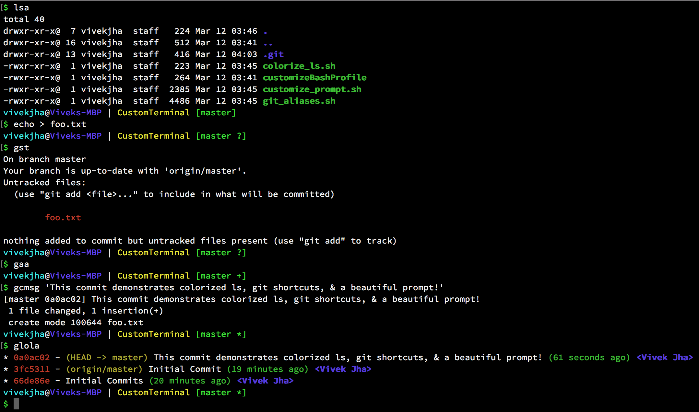

# CustomTerminal
Creates custom Bash prompt, colorizes `ls` command, and adds common aliases



## Installation
Open a terminal session and paste the following lines of code:

```
CUSTOM="~/.bash_custom"
mkdir "~/.bash_custom" && cd "~/.bash_custom"
```
Now clone the repository to your local:

```
git clone "https://github.com/vivek-x-jha/CustomTerminal"
```

Paste the following commands to add them to your `.bashrc`:

```
echo -e '\nchmod +x "~/.bash_custom/*.sh"' >> "~/.bashrc"
echo -e '\n"~/.bash_custom/customize_prompt.sh"' >> "~/.bashrc"
echo -e '\n"~/.bash_custom/colorize_ls.sh"' >> "~/.bashrc"
echo -e '\n"~/.bash_custom/git_aliases.sh"' >> "~/.bashrc"
```
Finally, reload your shell:

```
. "~/.bashrc"
```
